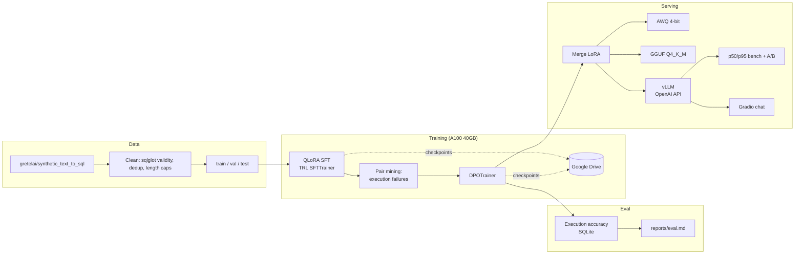

# llm-finetune-inference-lab

End-to-end LLM fine-tuning lab: QLoRA SFT + DPO of Qwen3-8B for text-to-SQL on a single A100 40GB (Colab Pro+), execution-accuracy evaluation, AWQ/GGUF export and vLLM serving with an OpenAI-compatible API.


> Demo GIF placeholder — `docs/demo.gif`

## Architecture



## Why text-to-SQL

The domain has an objective, executable ground truth: every prediction is parsed with sqlglot and executed against the example's schema in SQLite, so "before vs after" numbers are execution facts, not judge opinions. Dataset: `gretelai/synthetic_text_to_sql`, filtered to ~4k high-quality examples (parse-valid SQL and schema, question dedup, length caps).

## Quickstart

```bash
git clone https://github.com/dataeclipse/llm-finetune-inference-lab
cd llm-finetune-inference-lab
uv sync --group dev --extra train
uv run lab config show                 # cpu_smoke profile by default
uv run lab data prepare
uv run lab train sft                   # 2 steps on SmolLM2-135M, CPU, ~1 min
uv run pytest tests -m "not smoke"     # unit suite
uv run pytest tests -m smoke           # full CPU train smoke
```

The real run happens on Colab Pro+ via [notebooks/run_on_colab.ipynb](notebooks/run_on_colab.ipynb): clone → `uv sync` → mount Drive → `lab train sft profile=colab_a100` → pair mining through vLLM → DPO → eval → export. Checkpoints land on Drive and both trainers resume automatically after a dropped session.

Every workflow is a CLI (`lab data|train|eval|export|serve|bench`) with Hydra overrides, e.g.:

```bash
uv run lab train sft profile=colab_a100 sft.learning_rate=1e-4 lora.r=32
```

## Hardware profiles

| Profile | Model | Precision | Purpose |
|---------|-------|-----------|---------|
| `colab_a100` | Qwen3-8B | 4-bit NF4 + bf16 LoRA, grad checkpointing | production fine-tune |
| `cpu_smoke` | SmolLM2-135M-Instruct | fp32, 2 steps | CI / local smoke, same code path |

Multi-GPU readiness: `configs/distributed/` contains `accelerate` FSDP and DeepSpeed ZeRO-3 configs; tested on a single A100, ready for multi-node — see [docs/distributed.md](docs/distributed.md) for the ZeRO-1/2/3 sharding and offload breakdown.

## Evaluation

Primary metric — execution accuracy: gold and predicted SQL run against the example schema in in-memory SQLite and must return identical row sets. Secondary: parse validity, sqlglot-normalized match, optional LLM-as-judge.

| Model | N | Valid SQL | Exec accuracy | Overall |
|-------|---|-----------|---------------|---------|
| Qwen3-8B (base) | 200 | — | — | — |
| + QLoRA SFT | 200 | — | — | — |
| + DPO | 200 | — | — | — |

> Table is produced by `lab eval run` (appends to `reports/eval.md`); numbers pending the A100 training run. The full scorer pipeline is verified by 66 CPU unit tests, and the training loop by the CPU smoke suite.

Quantization and serving benchmarks (`lab export awq|gguf`, `lab bench latency`) report perplexity, tokens/s and p50/p95/p99 latency into `reports/`.

## Design Decisions

| ADR | Decision |
|-----|----------|
| [0001](docs/adr/0001-base-model.md) | Qwen3-8B base; SmolLM2-135M smoke profile shares the code path |
| [0002](docs/adr/0002-qlora-over-full-finetune.md) | QLoRA NF4: 8B training in ~12GB VRAM with Drive-resumable checkpoints |
| [0003](docs/adr/0003-dpo-pairs-from-execution-failures.md) | DPO pairs mined from the SFT model's own execution failures |
| [0004](docs/adr/0004-execution-accuracy-metric.md) | Execution accuracy over string match or LLM judge |
| [0005](docs/adr/0005-vllm-serving.md) | vLLM behind an OpenAI-compatible seam; AWQ + GGUF exports |

## Project Structure

```
src/lab/
├── config.py        # Hydra structured configs (profiles: colab_a100, cpu_smoke)
├── cli.py           # Typer CLI: data / train / eval / export / serve / bench
├── data/            # download, sqlglot cleaning, chat formatting, stats
├── training/        # SFT, DPO, checkpoint resume, preference pair mining
├── eval/            # execution accuracy, perplexity, LLM judge
├── quantization/    # LoRA merge, AWQ, GGUF, quant benchmark
├── serving/         # vLLM launcher, OpenAI client, latency bench, A/B
└── monitoring/      # nvidia-smi sampling
configs/distributed/ # accelerate FSDP + DeepSpeed ZeRO-3
pipelines/           # Prefect flow: data → sft → dpo → eval → merge
notebooks/           # Colab Pro+ orchestration
ui/                  # Gradio chat with latency/tokens panel
```

## Serving

```bash
uv sync --extra serve                  # linux + cuda
uv run lab serve vllm profile=colab_a100
uv run lab bench latency --concurrency 8 --requests 64
uv run lab bench ab --base-url-a http://host:8000/v1 --base-url-b http://host:8001/v1
docker compose -f docker-compose.gpu.yml up   # vllm + gradio ui
```

## Development

```bash
make test        # 66 unit tests, 80% coverage, no GPU, no model downloads
make test-smoke  # real SFT + DPO on CPU with a 135M model
make lint        # ruff + black
make typecheck   # mypy --strict
```

CI: lint → typecheck → unit tests → CPU smoke train (cached 135M model) → docker build.

## License

MIT
